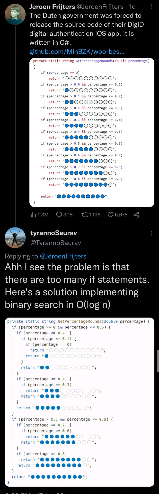

# Why?



Just my own curiosity on the meme about the progress bar code unveiled by the Dutch government.
I'm a proponent of unrolling a tightly or limited scope specification like this for the ease of reading and performance it brings. But does it perform better?

## Benchmarks

This repo includes various implementations suggested by colleagues. The last one, `GetProgressPrepared`, is my own suggestion.

For the benchmark a random set of 100 double values are prepared as the input. Then each method is run 100 times using the exact same input set.
The results really speak for themselves:

```

|                     Method |        Mean |    Error |   StdDev |
|--------------------------- |------------:|---------:|---------:|
|        GetProgressUnrolled |    474.2 ns |  3.49 ns |  3.26 ns |
|              GetProgressBT |    372.9 ns |  3.04 ns |  2.85 ns |
|          GetProgressLooped |  5,327.8 ns | 67.05 ns | 62.71 ns |
|          GetProgressPadded |  2,671.4 ns | 16.14 ns | 14.31 ns |
| GetProgressPaddedWithCache |  1,165.4 ns |  1.62 ns |  1.35 ns |
|      GetProgressEnumerable | 13,963.2 ns | 88.88 ns | 87.29 ns |
|        GetProgressPrepared |    151.8 ns |  0.30 ns |  0.28 ns |

```